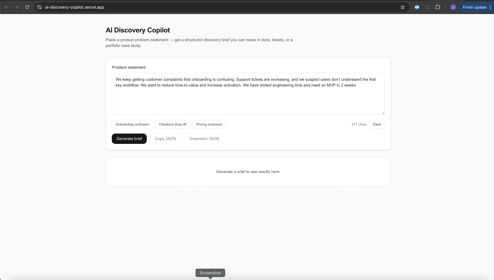
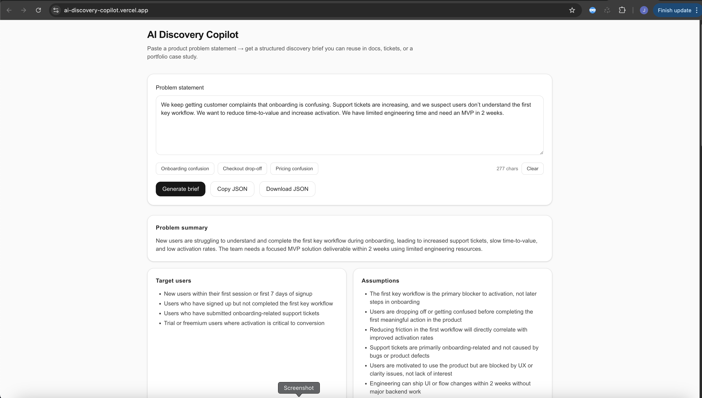

# AI Discovery Copilot

AI-powered product discovery tool that converts messy problem statements into a structured discovery brief:
assumptions, target users, MVP scope (2 weeks), success metrics, risks, experiments, and instrumentation events.

**Live demo:** (paste your Vercel URL here)  
**Tech:** Next.js (App Router), Tailwind CSS, Claude Sonnet 4.6 (Anthropic)

---

## Why this exists

Teams often lose time turning qualitative feedback into a clear plan. This tool accelerates early discovery by producing a consistent brief that can be pasted into product docs, Jira tickets, or a PRD.

---

## Features

- Paste a problem statement → generates a structured discovery brief
- Stable JSON output with validation + automatic repair (production-style reliability)
- Example prompts + clean UI
- Export: copy/download JSON

---

## Output schema

The brief includes:
- problem_summary
- assumptions
- target_users
- current_pain_signals
- desired_outcomes
- mvp_scope_2_weeks (must_have / nice_to_have / out_of_scope)
- key_user_flows
- success_metrics
- risks_and_unknowns
- experiment_plan
- instrumentation_events

---

## Run locally

1) Install
```bash
npm install

2) Add env var
Create .env.local:
ANTHROPIC_API_KEY="YOUR_KEY"

3) Start dev server 
npm run dev

Notes

Uses Claude Sonnet 4.6 (claude-sonnet-4-6)

API route: POST /api/generate

## Screenshots




